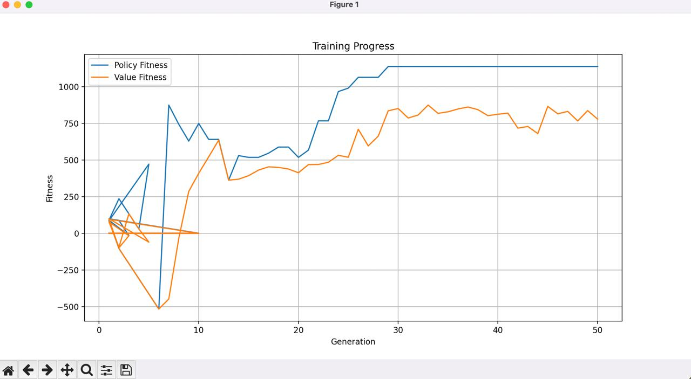
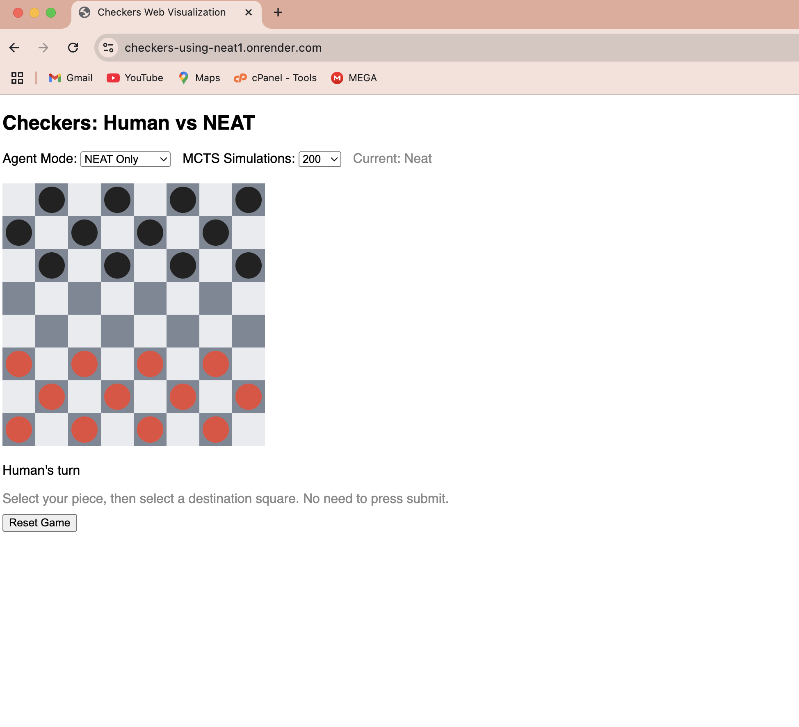

# Checkers AI Using NEAT - Documentation

---

## 1. Project Overview

Checkers AI Using NEAT is a feature-rich project that leverages NeuroEvolution of Augmenting Topologies (NEAT) to train an AI agent to play Checkers. Inspired by AlphaGo, this project demonstrates how neural networks can evolve through self-play, reinforcement, and neuroevolution to master a classic board game.

---

## 2. Features
- Modular Checkers game engine (all rules, legal moves, win/draw detection)
- NEAT integration (using `neat-python`)
- Multiple agent types: NEAT, MCTS+NEAT, Random, Value-based
- Agent vs Agent and Agent vs Human play modes
- Training loop with logging, checkpointing, and performance analysis
- Visualization: text-based, pygame, and web (Flask)
- Web deployment via Render
- Configurable NEAT parameters
- Easy extensibility for new features

---

## 3. How It Works

### 3.1 NEAT (NeuroEvolution of Augmenting Topologies)
- Evolves both the weights and structure of neural networks
- Used to create agents that learn to play Checkers through self-play

### 3.2 MCTS (Monte Carlo Tree Search)
- MCTS+NEAT agent uses NEAT networks to guide search and evaluation
- Allows for more strategic play by simulating many possible futures

### 3.3 Game Engine
- Written in Python, supports all Checkers rules
- Board representation, move generation, win/draw detection

---

## 4. Installation & Setup

### Requirements
- Python 3.8+
- neat-python
- pygame
- numpy
- Flask

### Install dependencies
```bash
pip install -r requirements.txt
```

---

## 5. Usage

### 5.1 CLI Usage
- **Train the AI:**
  ```bash
  python main.py train
  ```
- **Play against the AI (CLI):**
  ```bash
  python main.py play
  ```
- **Visualize games (local, requires pygame):**
  ```bash
  python main.py visualize
  ```
- **Visualize NEAT vs Random:**
  ```bash
  python main.py viz_neat_vs_random
  ```
- **Visualize Random vs Random:**
  ```bash
  python main.py viz_random_vs_random
  ```

### 5.2 Web App (Flask)
- Run locally:
  ```bash
  python web_visualize.py
  ```
  Then open http://localhost:5000 in your browser.

### 5.3 Deploy to Render
- Push your code to GitHub
- Create a new Web Service on [Render](https://render.com/)
- Set the start command to:
  ```
  python web_visualize.py
  ```
- Your app will be available at a public URL
- Try it live: https://checkers-using-neat1.onrender.com/

---

## 6. Project Structure
- `checkers/` - Game logic and visualization
- `ai/` - AI agent, evaluation, and training code
- `main.py` - CLI entry point
- `web_visualize.py` - Flask web app
- `neat_config.txt` - NEAT configuration
- `requirements.txt` - Python dependencies
- `render.yaml` - Render deployment config
- `best_genome.pkl`, `best_policy_genome.pkl`, `best_value_genome.pkl` - Saved NEAT models
- `training_metrics.csv`, `fitness_log.csv`, `performance_log.pkl` - Training logs and metrics

---

## 7. Training & Evaluation
- Training is performed via `main.py train` using NEAT.
- Evaluation scripts compare NEAT agents to Random agents.
- Visualizations and logs are saved for analysis.

### Example Training Plot


---

## 8. Extending the Project
- Add new agent types in `ai/`
- Modify reward functions or evaluation strategies
- Change NEAT parameters in `neat_config.txt`
- Add new visualizations or web features

---

## 9. Troubleshooting
- **502 Bad Gateway on Render:** Ensure `web_visualize.py` uses the correct port:
  ```python
  import os
  port = int(os.environ.get("PORT", 5000))
  app.run(host="0.0.0.0", port=port)
  ```
- **Missing .pkl files:** Train the agent first (`python main.py train`) or provide pre-trained models.
- **Pygame errors:** Some features require a local display (not available on Render).
- **Large files:** Do not commit files >100MB to GitHub. Use `.gitignore` for logs and checkpoints.

---

## 10. Screenshots & Visuals

### Web App Screenshot


---

## 11. License & Credits
- MIT License (see LICENSE file)
- Inspired by AlphaGo and the power of neuroevolution!

---

## 12. Contact
For questions, suggestions, or contributions, please open an issue or pull request on GitHub.

---

## 13. Frequently Asked Questions (FAQ)

**Q1: What is NEAT and why use it for Checkers?**  
A: NEAT (NeuroEvolution of Augmenting Topologies) is an evolutionary algorithm that evolves both the weights and structure of neural networks. It is well-suited for game AI because it can discover effective strategies and adapt its architecture over time, making it ideal for complex games like Checkers.

**Q2: How do I train the AI from scratch?**  
A: Run `python main.py train`. This will start the NEAT training loop, evolving agents through self-play and saving the best models as .pkl files.

**Q3: Can I play against the AI in my browser?**  
A: Yes! You can play online at [https://checkers-using-neat1.onrender.com/](https://checkers-using-neat1.onrender.com/) or run the web app locally with `python web_visualize.py`.

**Q4: What if I get a 502 Bad Gateway error on Render?**  
A: Make sure your `web_visualize.py` uses the correct port:
```python
import os
port = int(os.environ.get("PORT", 5000))
app.run(host="0.0.0.0", port=port)
```

**Q5: Why do I see errors about missing .pkl files?**  
A: The .pkl files are saved NEAT models. You need to train the agent first (`python main.py train`) or provide pre-trained models in the project directory.

**Q6: How do I change the AI’s difficulty or behavior?**  
A: You can adjust NEAT parameters in `neat_config.txt`, change the number of MCTS simulations in the web app, or modify agent code in the `ai/` folder.

**Q7: Can I use this project for other board games?**  
A: The code is modular and can be adapted for other turn-based board games with some changes to the game logic and agent interfaces.

**Q8: How do I contribute or report issues?**  
A: Open an issue or pull request on GitHub. Contributions, bug reports, and suggestions are welcome!

**Q9: What license is this project under?**  
A: MIT License. You are free to use, modify, and distribute the code with attribution.

**Q10: Where can I find more information or contact the author?**  
A: Email: binidani1903@gmail.com 
   Telegram: @benasphy
